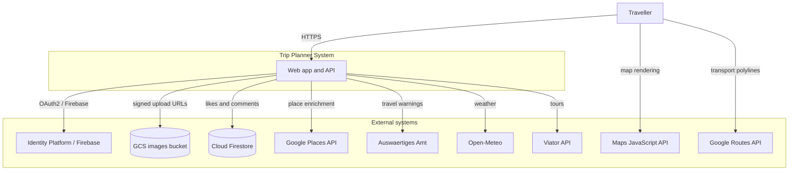
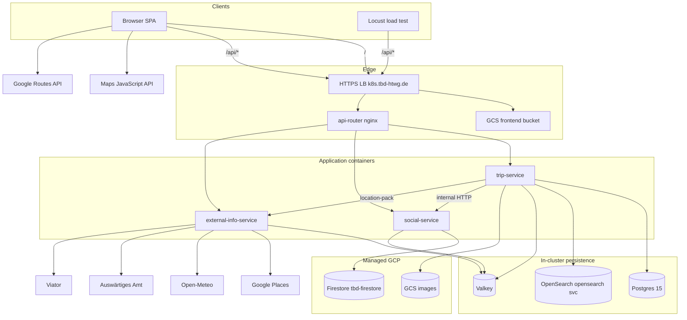
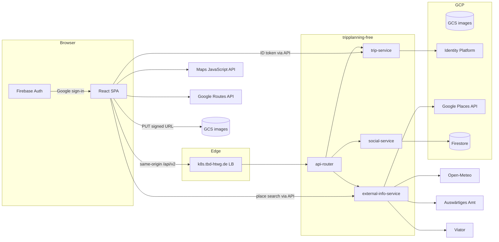
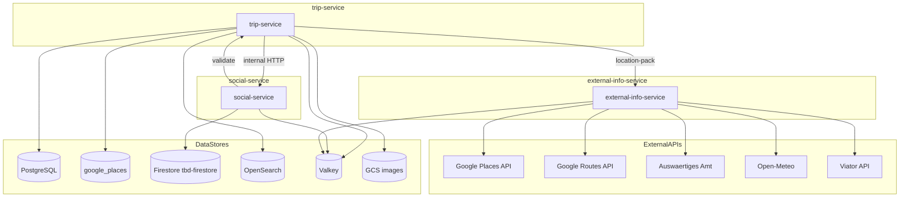
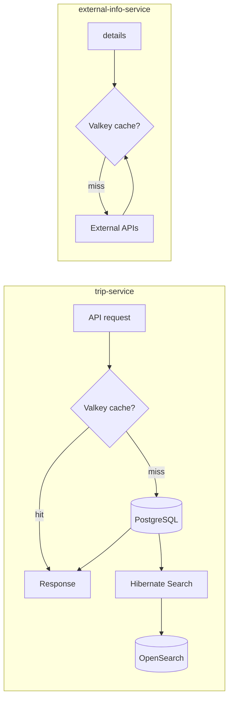

# ms2 platform state — architecture & GKE inventory

Reference for the **GKE dev** stack: C4-style application views (C1–C3), Terraform/GitOps resources, routing, and data flows for tenant **`tripplanning-free`**.

**Scope:** GCP project `tbd-cloudappdev`, region `europe-west1`, cluster `tripplanning-gke`, namespace `tripplanning-free`. For setup/teardown and Flux reconcile commands, see [overview.md](overview.md) and [Terraform dev env](../terraform/envs/dev/README.md). Local Minikube counterpart: [backend/docs/gettingstarted/STATE.md](../../../backend/docs/gettingstarted/STATE.md).

---

## Architecture levels

| Level | Section | What it shows |
|-------|---------|---------------|
| **C1** | [§1 System context](#1-c1--system-context) | Users and external systems |
| **C2** | [§2 Containers](#2-c2--containers) | Deployed apps, edge routing, data stores |
| **C3** | [§3 Components](#3-c3--service-components) | Modules inside each microservice |
| **GKE** | [§4–§14](#4-gke-resource-inventory) | Terraform, GitOps, routing tables, secrets, naming |

---

## 1. C1 — System context



| Actor / system | Role |
|----------------|------|
| **Traveller** | Uses React SPA; plans trips, social interactions, uploads images |
| **Identity Platform** | Google sign-in; trip-service verifies Firebase ID tokens |
| **GCS images bucket** | Trip/profile image blobs; browser PUT via signed URLs from trip-service |
| **Cloud Firestore** | Likes and comments (`tbd-firestore`) |
| **Google Places API** | Place search and details via external-info-service |
| **Maps JavaScript API** | Trip detail map (browser, client-side key) |
| **Google Routes API** | Transport route polylines on trip detail (browser, client-side) |
| **Open-Meteo, Auswärtiges Amt, Viator** | Stop weather, travel warnings, accommodation tours |

---

## 2. C2 — Containers

Deployed ms2 layout (not the legacy monolith gateway split). **Cloud SQL is not used in dev** — Postgres runs in-cluster.

**Primary path:** SPA and **Locust** (MS2 perf tests) use `https://k8s.tbd-htwg.de` → frontend HTTPS LB → api-router → microservices. Optional GKE Gateway host `api.k8s.tbd-htwg.de` — see [§5 Routing tables](#5-routing-tables).



| Container | Technology | Backing stores |
|-----------|------------|----------------|
| **React SPA** | Vite build on GCS | Same-origin `/api/v2` via frontend LB |
| **api-router** | nginx 1.27 | Stateless; path proxy to trip / social / external-info |
| **trip-service** | Spring Boot | Postgres, OpenSearch, Valkey, GCS |
| **social-service** | Spring Boot | Firestore, Valkey |
| **external-info-service** | Spring Boot WebFlux | Valkey; external HTTP APIs |
| **Postgres** | StatefulSet 15-alpine | Trip relational data + `google_places` cache table |
| **OpenSearch** | StatefulSet 2.19 (`opensearch` svc) | Hibernate Search index `tripentity` |
| **Valkey** | Deployment 8-alpine | Feed/search coordination + API response cache |

---

## 3. C3 — Service components

Brief module map (not code-level C4).

### trip-service

| Component | Responsibility | Key paths |
|-----------|----------------|-----------|
| **Auth** | dev-login (local only), Firebase token exchange, JWT issuance | `/api/v2/auth/**` |
| **Trips & users** | CRUD, feed, accommodations, transports, Google Places IDs | `/api/v2/trips/**`, `/api/v2/users/**` |
| **Places cache** | `google_places` JPA table; calls external-info `location-pack` on writes | `PlaceService`, Flyway V10–V14 |
| **Search** | Hibernate Search + OpenSearch; mass indexing coordination | `/api/search`, `SearchIndexCoordinationService` |
| **Images** | GCS signed URL generation via impersonated signer SA | `/api/v2/.../image` |
| **Internal** | Search-index debug, location-pack consumer | `/internal/**` |

### social-service

| Component | Responsibility | Key paths |
|-----------|----------------|-----------|
| **Likes** | Trip and user like collections | `/api/v2/trips/.../like`, `/api/v2/users/.../likedTrips` |
| **Comments** | Create/list/update comments | `/api/v2/comments`, trip community |
| **Community reads** | Aggregated bundle with Valkey cache | `CommunityCachedReader` |
| **Trip validation** | Internal call to trip-service before writes | HTTP client to trip-service |

### external-info-service

| Component | Responsibility | Key paths |
|-----------|----------------|-----------|
| **Places** | Text search, place details (cached) | `/api/v2/external/details/**` |
| **Stop details** | Weather + travel warnings | `/api/v2/external/stop-details` |
| **Accommodation** | Viator tours | `/api/v2/external/accommodation-details` |
| **Location pack** | Internal enrichment for trip-service writes | `/internal/location-pack` |
| **Transport route** | Distance/duration/polyline (also used by frontend Routes API) | Valkey-cached upstream calls |

---

## 4. GKE resource inventory

### Terraform (cloud resources)

Applied from [terraform/envs/dev](../terraform/envs/dev/). **Cloud SQL module exists but is not applied in dev.**

| Category | Resource | Name / pattern |
|----------|----------|----------------|
| **Project** | GCP | `tbd-cloudappdev` |
| **Network** | VPC, subnet, Cloud NAT | `tripplanning-vpc` |
| **Compute** | GKE Autopilot | `tripplanning-gke`, Gateway API enabled |
| **Data** | Firestore Native | `tbd-firestore` (+ composite index on `comments`) |
| **Storage** | GCS buckets | `tbd-cloudappdev-images-bucket`, `tbd-cloudappdev-frontend-bucket`, `tbd-cloudappdev-tfstate` |
| **DNS** | Cloud DNS zone | `tbd-htwg.de` — `k8s.tbd-htwg.de`, `api.k8s.tbd-htwg.de` |
| **LB** | Frontend global HTTPS LB | SPA + `/api/*` → api-router NEG |
| **LB** | Gateway global IP | `tripplanning-api-gateway-ip` → GKE Gateway |
| **Secrets** | Secret Manager placeholders | `tripplanning-db-password`, jwt, internal, maps, viator, ghcr, test-bearer |
| **IAM** | Service accounts | `workload`, `platform-admin`, `secrets-deployer`, `gitops`, `tripplanning-image-url-sig` |
| **IAM** | Workload Identity | external-secrets, cert-manager, `tripplanning-free/trip-service` |
| **CI** | GitHub OIDC WIF | Frontend deploy + backend secret sync |

### GitOps / platform namespaces

| Namespace | Contents |
|-----------|----------|
| `flux-system` | Flux controllers, Git sources |
| `cert-manager` | Let's Encrypt DNS-01 (`letsencrypt-dns`) |
| `external-secrets` | ClusterSecretStore → GCP Secret Manager |
| `gateway-system` | `tripplanning-gateway`, TLS secret `api-tls` |
| `tripplanning-free` | App HelmRelease, tenant ExternalSecrets, workloads |

Flux paths: [gitops/clusters/dev](../gitops/clusters/dev/), [gitops/tenants/free/shared](../gitops/tenants/free/shared/).

### In-cluster (namespace `tripplanning-free`)

| Component | Implementation | Source |
|-----------|----------------|--------|
| **api-router** | nginx Deployment + NEG | [charts/tripplanning](../charts/tripplanning/) |
| **trip-service** | Spring Boot, GHCR image | Helm + [values-configmap.yaml](../gitops/tenants/free/shared/values-configmap.yaml) |
| **social-service** | Spring Boot | same |
| **external-info-service** | Spring Boot WebFlux | same |
| **PostgreSQL** | Postgres 15 StatefulSet + PVC | chart `backingServices.postgres` |
| **Valkey** | Deployment | chart `backingServices.valkey` |
| **OpenSearch** | StatefulSet 2.19 (svc name `opensearch`) | chart `backingServices.opensearch` |
| **seed-job** | Optional perf seed Job | chart `seedJob` (disabled by default) |

Installed by Flux `HelmRelease tripplanning-free` reconciling chart + tenant values ConfigMap.

---

## 5. Routing tables

### api-router (frontend LB and Gateway paths via NEG)

From [api-router-configmap.yaml](../charts/tripplanning/templates/configmaps/api-router-configmap.yaml):

| Path pattern | Backend |
|--------------|---------|
| `/api/v2/trips/search/countLikes` | social-service:8081 |
| `/api/v2/trips/{id}/community`, `comments`, `liked-by-current-user`, `like` | social-service:8081 |
| `/api/v2/users/{id}/likedTrips` (collection POST and item GET/DELETE) | social-service:8081 |
| `/api/v2/comments` | social-service:8081 |
| `/api/v2/external` | external-info-service:8082 |
| `/api/search` | trip-service:8080 |
| `/` (default) | trip-service:8080 |

### HTTPRoute (Gateway host `api.k8s.tbd-htwg.de`)

From [values.yaml `routes`](../charts/tripplanning/values.yaml):

| Path prefix | Service:port |
|-------------|--------------|
| `/api/v2/comments` | social-service:8081 |
| `/api/v2/external` | external-info-service:8082 |
| `/api/search` | trip-service:8080 |
| `/api/v2/trips`, `/api/v2/users` | api-router:8088 |
| `/api/v2`, `/actuator`, `/swagger-ui`, `/v3` | trip-service:8080 |

Local Minikube uses nginx Ingress with similar splits (no api-router); see [backend STATE.md §3](../../../backend/docs/gettingstarted/STATE.md).

---

## 6. Frontend data flow



**Behaviors:**

- SPA built with **empty** `VITE_API_BASE_URL`; all API calls are same-origin `/api/v2`.
- **No dev-login** on GKE — Firebase / test bearer for load tests only.
- Place search: `GET /api/v2/external/details/search` via api-router.
- Image uploads: signed URL from trip-service; browser PUT to GCS (Workload Identity + signer SA).

---

## 7. Backend microservices & data stores

| Service | Container port | K8s Service port | Role |
|---------|----------------|------------------|------|
| api-router | 8088 | 8088 | Path-based proxy for social/trip user routes |
| trip-service | 8080 | 8080 | Trips, users, auth, search, GCS signed URLs |
| social-service | 8081 | 8081 | Likes & comments (Firestore) |
| external-info-service | 8082 | 8082 | Places, weather, warnings, Viator, transport metadata |



### Per-service data store usage

| Service | SQL | OpenSearch | Valkey | Firestore | GCS | Other HTTP |
|---------|:---:|:----------:|:------:|:---------:|:---:|------------|
| **trip-service** | Postgres + `google_places` (Flyway V1–V14) | Index `tripentity` | Feed cache 30s; search-index lock/status | — | Signed uploads via WI | social, external-info |
| **social-service** | — | — | Community bundle cache 30s | `tbd-firestore` | — | trip-service |
| **external-info-service** | — | — | Reactive cache (places 7d, volatile 1d) | — | — | Places, Routes, AA, Meteo, Viator |

**In-cluster DNS:**

- `postgres.tripplanning-free.svc.cluster.local:5432`
- `opensearch.tripplanning-free.svc.cluster.local:9200`
- `valkey.tripplanning-free.svc.cluster.local:6379`
- `trip-service.tripplanning-free.svc.cluster.local:8080`
- `social-service.tripplanning-free.svc.cluster.local:8081`
- `external-info-service.tripplanning-free.svc.cluster.local:8082`
- `api-router.tripplanning-free.svc.cluster.local:8088`

**Inter-service HTTP only** — no message broker. `X-Internal-Secret` on `/internal/**` when `TRIPPLANNING_INTERNAL_SECRET` is set.

---

## 8. Valkey & OpenSearch



| System | Used by | Purpose |
|--------|---------|---------|
| **OpenSearch** | trip-service (`k8s` profile) | Index `tripentity`; `HIBERNATE_SEARCH_BACKEND_VERSION=opensearch:2.19`; service DNS `opensearch:9200` |
| **Valkey** | trip-service, social-service, external-info-service | Trip feed cache; social community bundle; external-info reactive cache; **SearchIndexCoordinationService** lock (`tripplanning:search:index:*`) |

**SearchIndexCoordinationService:** pods may stay **Not Ready** for 1–3+ minutes on cold start until mass indexing completes. Readiness includes `searchIndex` health.

**trip-service Valkey cache names** (30s TTL in GitOps overlay): `tripFeedPage`, `tripFeedByUser`, `tripFeedLikedBy`, `tripDetail`, `tripExists`.

**external-info Valkey namespaces:** `places` (7d), `warnings`, `weather`, `tours`, `transportRoute` (1d).

**social-service:** `communityBundlev1` cache (30s TTL via `TRIPPLANNING_CACHE_REDIS_TTL_SECONDS`).

---

## 9. Secrets

| GCP Secret Manager key | K8s secret | Keys synced |
|------------------------|------------|-------------|
| `tripplanning-db-password` | `trip-service-secrets` | `SPRING_DATASOURCE_PASSWORD`, `password` |
| `tripplanning-jwt-secret` | `trip-service-secrets`, `social-service-secrets`, `external-info-service-secrets` | `TRIPPLANNING_AUTH_JWT_SECRET` |
| `tripplanning-internal-secret` | all three service secrets | `TRIPPLANNING_INTERNAL_SECRET` |
| `tripplanning-auth-test-bearer-token` | all three (dev/load-test) | `TRIPPLANNING_AUTH_TEST_BEARER_TOKEN` |
| `tripplanning-google-maps-api-key` | `external-info-service-secrets` | `GOOGLE_MAPS_API_KEY` |
| `tripplanning-viator-api-key` | `external-info-service-secrets` | `VIATOR_API_KEY` |
| `tripplanning-ghcr-pull-dockerconfigjson` | `ghcr-pull` | `.dockerconfigjson` |

ExternalSecret definitions: [external-secrets.yaml](../gitops/tenants/free/shared/external-secrets.yaml). Populate values per [overview.md §4](overview.md).

ConfigMaps (CORS, service URLs, OpenSearch/Valkey hosts) come from the Helm chart; non-secret env is in [values.yaml](../charts/tripplanning/values.yaml) and tenant overlay.

---

## 10. Naming quick reference

```
GCP project:      tbd-cloudappdev
region:           europe-west1
GKE cluster:      tripplanning-gke
namespace:        tripplanning-free
frontend URL:     https://k8s.tbd-htwg.de
API Gateway URL:  https://api.k8s.tbd-htwg.de
images bucket:    tbd-cloudappdev-images-bucket
frontend bucket:  tbd-cloudappdev-frontend-bucket
Firestore DB:     tbd-firestore
Postgres:         postgres:5432 (db tripplanning, user tripplanning_app)
search svc:       opensearch:9200 (OpenSearch 2.19 image)
signer SA:        tripplanning-image-url-sig@tbd-cloudappdev.iam.gserviceaccount.com
workload SA:      workload@tbd-cloudappdev.iam.gserviceaccount.com
trip-service:     ghcr.io/tbd-htwg/backend/tripplanning-trip-service:latest
social-service:   ghcr.io/tbd-htwg/backend/tripplanning-social-service:latest
external-info:    ghcr.io/tbd-htwg/backend/tripplanning-external-info-service:latest
```

---

## 11. Repository layout (infrastructure/ms2)

| Path | Purpose |
|------|---------|
| `terraform/envs/dev/` | Dev GCP apply (network, GKE, buckets, DNS, Firestore) |
| `terraform/modules/` | Reusable Terraform modules |
| `gitops/clusters/dev/` | Flux cluster bootstrap, platform add-ons |
| `gitops/tenants/free/shared/` | Tenant namespace, ExternalSecrets, HelmRelease values |
| `charts/tripplanning/` | Application Helm chart (services, backing stores, HTTPRoute, api-router) |
| `docs/STATE.md` | This document |
| `docs/overview.md` | Setup runbook (unchanged) |

---

## 12. Key source files

| Topic | Path |
|-------|------|
| Terraform dev env | [terraform/envs/dev/main.tf](../terraform/envs/dev/main.tf) |
| Helm defaults | [charts/tripplanning/values.yaml](../charts/tripplanning/values.yaml) |
| Tenant overlay (replicas, HPA, resources) | [gitops/tenants/free/shared/values-configmap.yaml](../gitops/tenants/free/shared/values-configmap.yaml) |
| api-router nginx rules | [charts/tripplanning/templates/configmaps/api-router-configmap.yaml](../charts/tripplanning/templates/configmaps/api-router-configmap.yaml) |
| External Secrets | [gitops/tenants/free/shared/external-secrets.yaml](../gitops/tenants/free/shared/external-secrets.yaml) |
| Spring GKE profile | [backend/tripplanning-trip-service/src/main/resources/application-k8s.yml](../../../backend/tripplanning-trip-service/src/main/resources/application-k8s.yml) |
| Local Minikube state | [backend/docs/gettingstarted/STATE.md](../../../backend/docs/gettingstarted/STATE.md) |
| Frontend API client | [frontend/src/api/client.ts](../../../frontend/src/api/client.ts) |
| C4 diagram sources | [ContextDiagram_Syntax.mmd](ContextDiagram_Syntax.mmd), [ContainerDiagram_Syntax.mmd](ContainerDiagram_Syntax.mmd) |

---

## 13. Local vs GKE (quick reference)

Full local inventory: [backend/docs/gettingstarted/STATE.md](../../../backend/docs/gettingstarted/STATE.md).

| Aspect | Local Minikube | GKE dev (this doc) |
|--------|----------------|---------------------|
| **Namespace** | `tripplanning` | `tripplanning-free` |
| **Deploy** | `./scripts/local-dev.sh` + local Helm chart | Terraform + Flux + ms2 Helm chart |
| **API entry** | nginx Ingress → `localhost:8080` port-forward | `https://k8s.tbd-htwg.de/api/*` + `https://api.k8s.tbd-htwg.de` |
| **api-router** | No — Ingress routes directly | Yes |
| **Firestore** | In-cluster emulator | Managed `tbd-firestore` |
| **Postgres** | In-cluster Postgres 16 | In-cluster Postgres 15 |
| **Search DNS** | `opensearch:9200`, index `tripentity-local` | `opensearch:9200`, index `tripentity` |
| **Secrets** | `docs/gettingstarted/.env` | GCP Secret Manager → External Secrets |
| **Images** | `tripplanning-*-service:local` | `ghcr.io/tbd-htwg/backend/...:latest` |
| **Auth** | dev-login + optional Firebase | Firebase + optional test bearer (perf) |
| **HPA** | Off | On (GitOps overlay) |

---

## 14. C4 diagram sources

Editable C4 PlantUML/Mermaid sources (for Structurizr or IDE plugins):

- **C1:** [ContextDiagram_Syntax.mmd](ContextDiagram_Syntax.mmd)
- **C2:** [ContainerDiagram_Syntax.mmd](ContainerDiagram_Syntax.mmd)

Canonical rendered copies for the deployed stack are the mermaid blocks in §1 and §2 above.
