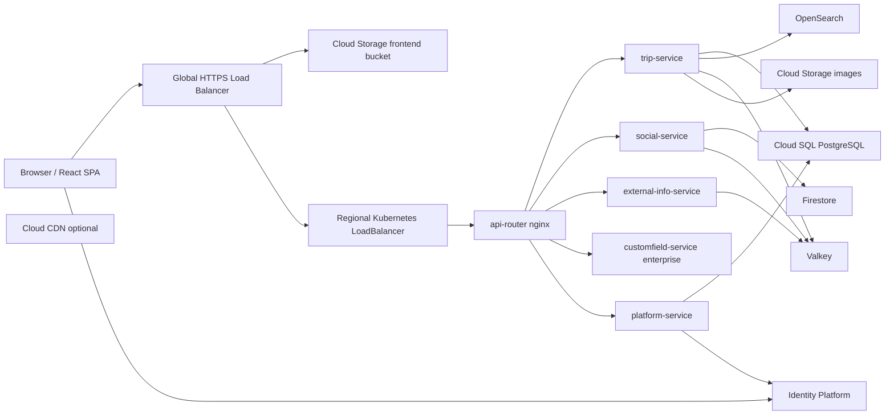

# Cloud and Kubernetes Architecture

## Management Summary

TripPlanning runs on Google Cloud with GKE Autopilot as the main runtime. The
application is split into a static React frontend, backend microservices, tenant
routing, managed identity, databases, object storage, and observability.

The current architecture is designed around three goals:

- Keep common platform operations centralized.
- Keep tenant traffic and data separated according to the tenant tier.
- Let infrastructure be recreated from code instead of manual console setup.

For product and operations planning, the most important point is that tenant
isolation is not only an application feature. It is also represented in
Kubernetes namespaces, Identity Platform tenants, Cloud SQL databases or
instances, storage prefixes or buckets, routing rules, and network policies.

## Runtime Overview

The frontend is built as a static Vite/React application and uploaded to a Cloud
Storage bucket. The global HTTPS load balancer serves the frontend and forwards
API paths to the Kubernetes `api-router` through an external endpoint.

Backend services run in GKE Autopilot:

- `api-router`: nginx router that maps hosts and API paths to services.
- `trip-service`: main trip API, PostgreSQL, OpenSearch, image storage, cache.
- `social-service`: comments and likes, backed by Firestore and cache.
- `external-info-service`: external detail APIs and cached external data.
- `customfield-service`: enterprise-only custom fields, backed by Firestore.
- `platform-service`: tenant registry, admin APIs, provisioning orchestration.
- `tripplanning-seed-job`: optional one-shot dataset seeding job.

The services are configured through ConfigMaps, Secrets, environment variables,
liveness/readiness probes, and resource requests/limits. Images are immutable at
deployment time because the backend pipeline deploys commit SHA tags.

## Main Google Cloud Resources

The relevant cloud resources are managed from `infrastructure/ms2`:

- GKE Autopilot cluster `tripplanning-gke` in `europe-west1`.
- Private VPC and subnet with secondary ranges for pods and services.
- Cloud DNS zone for `tbd-htwg.de`.
- Global HTTPS load balancer for the frontend domain `k8s.tbd-htwg.de`.
- Static regional addresses for standard and enterprise API routers.
- Cloud Storage bucket for frontend assets.
- Cloud Storage image bucket for shared tenants and separate image buckets for
  enterprise tenants.
- Cloud SQL for platform data, standard tenant data, and enterprise tenant data.
- Firestore database `tbd-firestore` for social/custom-field documents.
- Identity Platform with multi-tenancy enabled.
- Secret Manager for application secrets and browser API keys.
- Workload Identity Federation for GitHub Actions.
- External Secrets Operator to project Secret Manager values into Kubernetes.
- Google Cloud Managed Service for Prometheus.
- Cloud Service Mesh / managed Istio telemetry.

## Kubernetes Organization

The cluster state is applied by Flux from `infrastructure/ms2/gitops`.

Important namespaces:

- `flux-system`: Flux controllers and Git source.
- `tripplanning-system`: platform service and platform-level runtime resources.
- `tripplanning-free`: free tier runtime.
- `tripplanning-standard`: shared standard tier runtime.
- `tripplanning-ent-<tenant>`: dedicated enterprise tenant runtime.
- `gke-gmp-system`: managed Prometheus collection components.
- `istio-system`: managed mesh control plane and telemetry configuration.

The Helm chart `charts/tripplanning` defines the application runtime. Tier
values files (`values-free.yaml`, `values-standard.yaml`,
`values-enterprise.yaml`) keep differences visible and avoid copy-pasting whole
deployments.

## Synchronous and Asynchronous Services

Most user-facing operations are synchronous HTTP calls:

- Browser to frontend and API.
- `api-router` to backend services.
- Backend service-to-service calls where required.
- Backend calls to Cloud SQL, Firestore, OpenSearch, Valkey, and external APIs.

The provisioning flow is asynchronous:

- `platform-service` creates or updates tenant records.
- It sends a GitHub `repository_dispatch` event to infrastructure automation.
- Infrastructure writes tenant YAML, renders Terraform and GitOps inputs, and
  lets Flux reconcile the cluster.
- The provisioning callback updates the platform tenant status.

That separation keeps normal application requests fast while tenant lifecycle
changes can run through controlled infrastructure automation.

## Runtime Links

- Main frontend: `https://k8s.tbd-htwg.de`
- Tenant hosts: standard tenants use subdomains under `k8s.tbd-htwg.de`; enterprise tenants use subdomains under `enterprise.k8s.tbd-htwg.de`.
- Google Cloud project configured in Terraform: `tbd-cloudappdev`

