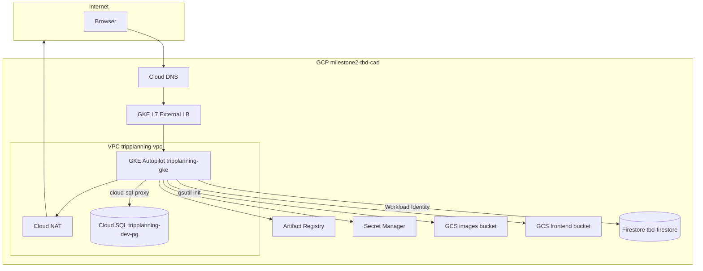
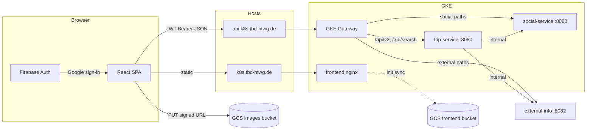
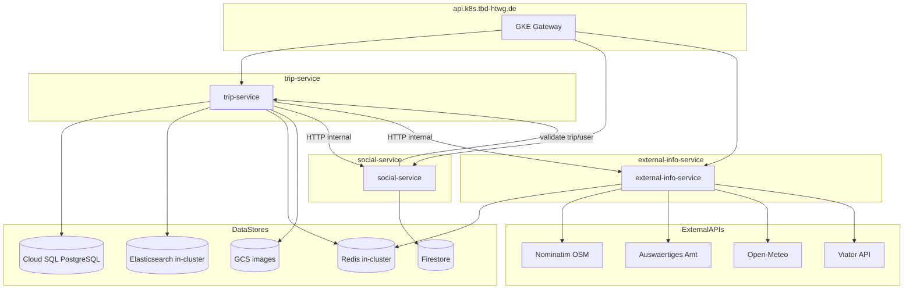
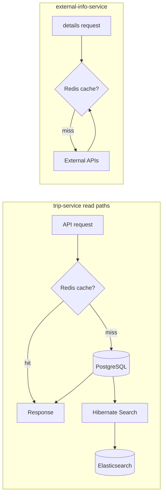

# MS2 deployed state — GCP resources & data flows

Reference for the **deployed MS2 (milestone 2)** stack: Google Cloud resources, public hostnames, and data flows for the frontend, backend microservices, Redis, and Elasticsearch.

**Scope:** GCP project `milestone2-tbd-cad`, region `europe-west1`, minimal dev profile ([`dev-lifecycle.sh`](dev-lifecycle.sh) + Terraform + kubectl). For setup/teardown, see [README.md](README.md).

---

## 1. Google Cloud resource inventory

### Core platform (Terraform)

| Category | Resource | Name / pattern | Defined in |
|----------|----------|----------------|------------|
| **Project** | GCP project | `milestone2-tbd-cad` | [`ms2/terraform/envs/dev/terraform.tfvars`](../../terraform/envs/dev/terraform.tfvars) |
| **APIs** | Enabled services | container, compute, sqladmin, artifactregistry, secretmanager, dns, storage, servicenetworking, iam, logging, monitoring, … | [`ms2/terraform/modules/project-bootstrap/`](../../terraform/modules/project-bootstrap/main.tf) |
| **Networking** | VPC | `tripplanning-vpc` | [`ms2/terraform/modules/network/`](../../terraform/modules/network/main.tf) |
| | Subnet | `tripplanning-subnet` — `10.10.0.0/20`, pods `10.20.0.0/16`, services `10.30.0.0/20` | same |
| | Cloud Router + NAT | `tripplanning-router` / `tripplanning-nat` | same |
| | PSA range | `tripplanning-dev-pg-private-range` — `10.40.0.0/16` | [`ms2/terraform/modules/cloudsql/`](../../terraform/modules/cloudsql/main.tf) |
| **Compute** | GKE Autopilot | `tripplanning-gke` (private nodes, Gateway API, Workload Identity) | [`ms2/terraform/modules/gke-autopilot/`](../../terraform/modules/gke-autopilot/main.tf) |
| **Database** | Cloud SQL PostgreSQL 15 | Instance `tripplanning-dev-pg`, DB `tripplanning`, user `tripplanning_app` (private IP only) | cloudsql module |
| **NoSQL** | Firestore | Database `tbd-firestore` | [`ms2/terraform/envs/dev/app_workload.tf`](../../terraform/envs/dev/app_workload.tf) |
| **Storage** | GCS buckets | `milestone2-tbd-cad-images-bucket`, `milestone2-tbd-cad-frontend-bucket`, `milestone2-tbd-cad-tfstate` | [`ms2/terraform/modules/storage/`](../../terraform/modules/storage/main.tf) |
| **Registry** | Artifact Registry | `europe-west1/tripplanning` (Docker) | project-bootstrap |
| **DNS** | Managed zones | `k8s-tbd-zone` (`k8s.tbd-htwg.de.`), optional `tbd-htwg-de-root` | [`ms2/terraform/envs/dev/dns.tf`](../../terraform/envs/dev/dns.tf) |
| | A records (when `gke_gateway_ip` set) | `api.k8s`, `social.api.k8s`, `k8s` → Gateway LB IP | dns.tf |
| **Secrets** | Secret Manager | `tripplanning-db-password`, `tbd-es-gateway-elastic-password`, `tripplanning-auth-jwt-secret`, `tripplanning-internal-secret`, `tripplanning-viator-api-key` | bootstrap + app_workload |
| **IAM** | Service accounts | `platform-admin@`, `gitops@`, `workload@`, `tripplanning-image-url-sig@` | bootstrap + app_workload |
| **KMS** | Key ring (disabled in dev) | `tripplanning-keyring` | [`ms2/terraform/modules/kms/`](../../terraform/modules/kms) — `kms.enabled = false` |

### Created by Kubernetes (not Terraform)

| Category | Resource | How |
|----------|----------|-----|
| **Load balancing** | Global external HTTP(S) LB | GKE Gateway `tripplanning-api`, class `gke-l7-global-external-managed` | [`ms2/gitops/tenants/tripplanning/gateway/`](../../gitops/tenants/tripplanning/gateway/) |
| **TLS** | Let's Encrypt certs | cert-manager + HTTP-01 via Gateway | `gateway-https.yaml` in gateway dir |

### In-cluster (not GCP-managed)

| Component | Implementation |
|-----------|----------------|
| **Redis** | Deployment `redis:7-alpine` — [`ms2/k8s/dependencies/redis/`](../../k8s/dependencies/redis/) |
| **Elasticsearch** | Deployment + PVC — [`ms2/k8s/dependencies/elasticsearch/`](../../k8s/dependencies/elasticsearch/) |

**Not used in MS2:** Cloud Memorystore, Cloud Run (MS2 deploy path), standalone Compute forwarding rules in Terraform.

### Manual / console-only

- **Firebase / Identity Platform** — OAuth, Web API keys (frontend `VITE_FIREBASE_*`)
- **Registrar NS** — points `tbd-htwg.de` at Terraform parent zone nameservers ([README §8a](README.md#8a-set-nameservers-at-the-registrar-manual))

---

## 2. High-level GCP topology



---

## 3. Public hostnames & routing

| Hostname | Serves | Backend |
|----------|--------|---------|
| `https://k8s.tbd-htwg.de` | SPA static assets | frontend pod (nginx; synced from GCS) |
| `https://api.k8s.tbd-htwg.de` | REST API | GKE Gateway → trip/social per [`httproute-api.yaml`](../../gitops/tenants/tripplanning/gateway/httproute-api.yaml) |
| `https://social.api.k8s.tbd-htwg.de` | Social API (alternate host) | social-service |

**Gateway path rules** on `api.k8s` (first match wins):

| Path prefix | Backend service |
|-------------|-----------------|
| `/api/v2/comments` | social-service |
| `/api/v2/trips/search/countLikes` | social-service |
| `/api/v2/trips/{id}/community`, `.../comments`, `.../liked-by-current-user`, `.../like` | social-service (regex) |
| `/api/v2/users/{id}/likedTrips/{tripId}` | social-service (regex; DELETE/HEAD) |
| `/api/v2/external` | external-info-service |
| `/api/search` | trip-service |
| `/api/v2` | trip-service (catch-all: trips, auth, HAL, liked-trips feed) |
| `/actuator`, `/swagger-ui`, `/v3` | trip-service |

**external-info-service** is public on `/api/v2/external/*` (JWT required). Trip-service still calls it in-cluster for trip-location enrichment via `ExternalInfoClient`.

---

## 4. Frontend data flow



**Behaviors:**

- Single API entry: `VITE_API_BASE_URL` → `https://api.k8s.tbd-htwg.de` (prod build via `dev-lifecycle.sh frontend`) or Vite dev proxy.
- JSON under `/api/v2`; full-text search under `/api/search`.
- Firebase for Google sign-in only; trip-service issues app JWT via `POST /api/v2/auth/google`.
- Image uploads: trip-service returns a GCS signed URL; browser **PUTs directly** to the images bucket (not through the Gateway).

---

## 5. Backend microservices & data stores

Three Spring Boot services (see [`backend/README-GKE.md`](../../../../backend/README-GKE.md)):

| Service | Container port | K8s Service port | Role |
|---------|----------------|------------------|------|
| trip-service | 8080 | 8080 | Trips, users, locations, auth, search, liked-trips feed |
| social-service | 8081 | **8080** → 8081 | Likes & comments (Firestore) |
| external-info-service | 8082 | 8082 | Weather, warnings, geocoding, tours (`/api/v2/external`) |



### Per-service data store usage

| Service | PostgreSQL | Elasticsearch | Redis | Firestore | GCS | Other HTTP |
|---------|:----------:|:-------------:|:-----:|:---------:|:---:|------------|
| **trip-service** | JPA + Flyway | Hibernate Search (`tripentity`) | Spring Cache (feed/detail, 10s TTL) | — | trip/profile images | social, external-info |
| **social-service** | — | — | — | likes, comments | — | trip-service (validation) |
| **external-info-service** | — | — | weather/warnings/tours (60m TTL) | — | — | 4 external APIs |

**In-cluster DNS** ([trip-service ConfigMap](../../gitops/tenants/tripplanning/trip-service/configmap.yaml)):

- `elasticsearch.tripplanning.svc.cluster.local:9200`
- `redis.tripplanning.svc.cluster.local:6379`

**Cloud SQL:** sidecar `cloud-sql-proxy` → private IP on PSA range `10.40.0.0/16`; JDBC to `127.0.0.1:5432`.

**Inter-service HTTP only** — no message broker. Optional `X-Internal-Secret` on `/internal/**` paths.

---

## 6. Redis & Elasticsearch



| System | Used by | Purpose |
|--------|---------|---------|
| **Elasticsearch** | trip-service only | Full-text search index `tripentity`; Hibernate Search backend in k8s profile |
| **Redis** | trip-service, external-info-service | Distributed cache (installed via [`install-k8s-dependencies.sh`](../../scripts/install-k8s-dependencies.sh)); Caffeine fallback when host unset (local dev) |

**trip-service Redis cache names** (10s TTL): `tripFeedPage`, `tripFeedByUser`, `tripFeedLikedBy`, `tripDetail`, `tripExists`.

**external-info-service Redis cache names** (60m TTL): `warnings`, `weather`, `tours`.

---

## 7. Workload Identity & secrets

| K8s service account | GCP SA | Access |
|---------------------|--------|--------|
| `tripplanning/trip-service` | `workload@` | Cloud SQL client, GCS images, Secret Manager, Artifact Registry pull |
| `tripplanning/social-service` | `workload@` | Firestore (`datastore.user`) |
| `tripplanning/frontend` | `workload@` | GCS frontend bucket read |

Secrets flow: **Secret Manager** → [`bootstrap-k8s-secrets.sh`](../../scripts/bootstrap-k8s-secrets.sh) → Kubernetes secrets (DB password, ES password, JWT, internal secret, Viator API key).

---

## 8. Naming quick reference

```
Project:     milestone2-tbd-cad
Region:      europe-west1
VPC:         tripplanning-vpc
Subnet:      tripplanning-subnet
GKE:         tripplanning-gke
Cloud SQL:   tripplanning-dev-pg  (DB tripplanning, user tripplanning_app)
Firestore:   tbd-firestore
Buckets:     milestone2-tbd-cad-{images,frontend,tfstate}
Artifact Registry: europe-west1-docker.pkg.dev/milestone2-tbd-cad/tripplanning/*
DNS child:   k8s.tbd-htwg.de
Hosts:       api.k8s.tbd-htwg.de, social.api.k8s.tbd-htwg.de, k8s.tbd-htwg.de
```

---

## 9. Key source files

| Topic | Path |
|-------|------|
| Terraform wiring | [`ms2/terraform/envs/dev/main.tf`](../../terraform/envs/dev/main.tf) |
| Lifecycle automation | [`dev-lifecycle.sh`](dev-lifecycle.sh), [README.md](README.md) |
| Gateway & HTTPRoutes | [`ms2/gitops/tenants/tripplanning/gateway/`](../../gitops/tenants/tripplanning/gateway/) |
| Redis / Elasticsearch manifests | [`ms2/k8s/dependencies/`](../../k8s/dependencies/) |
| Backend microservices | [`backend/README-GKE.md`](../../../../backend/README-GKE.md) |
| Frontend API client | [`frontend/src/api/client.ts`](../../../../frontend/src/api/client.ts) |
