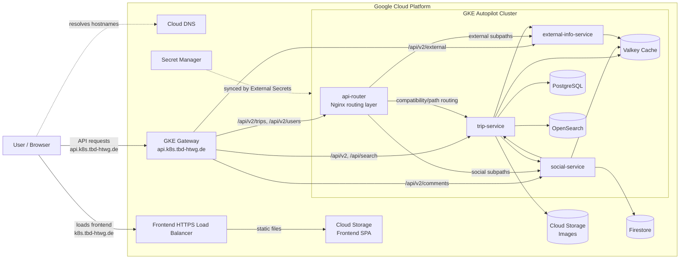

# 2 Runtime View

## 2.1 Runtime Overview

The application runs on Google Cloud and is split into a static frontend, a managed Kubernetes backend, and managed cloud services for storage, secrets, DNS, and networking.

The main goal of this setup is to keep the user-facing application easy to access while keeping the backend services isolated, independently scalable, and deployable through GitOps. This also follows several 12-Factor ideas: services are configured from the environment, backing services are attached through URLs/secrets, and application containers can be replaced without moving local state. The browser loads the frontend from `https://k8s.tbd-htwg.de`. Backend API traffic is intended to use the separate API hostname `https://api.k8s.tbd-htwg.de`, where the GKE Gateway routes requests into the cluster.

This routing approach keeps frontend and backend traffic separated by hostname. The `api-router` is used as a lightweight compatibility and routing layer for selected API paths, while the Gateway/HTTPRoute can also route requests directly to the owning service.

#TODO: The current Terraform/frontend pipeline still contains remnants of the older same-origin `/api/*` setup (`api_backend_neg_self_links` and frontend build logic that forces an empty `VITE_API_BASE_URL`). If the final architecture is only `api.k8s.tbd-htwg.de` for backend traffic, those IaC/pipeline parts should be removed or updated.

Running links:

- Frontend: `https://k8s.tbd-htwg.de`
- API: `https://api.k8s.tbd-htwg.de`
- GCP project: `tbd-cloudappdev`

## 2.2 Microservices

### api-router

The `api-router` is a small Nginx-based routing service. Its purpose is to be the central internal entry point for API traffic. It forwards requests to the correct backend service based on the path.

This is useful because the frontend does not need to know which service owns which endpoint. It also allows backend services to be split or reorganized without changing the public API structure. It currently runs with 2 replicas and does not use automatic scaling. Since it does not own persistent state, it can be restarted or replaced easily, which fits the 12-Factor disposable-process idea.

### trip-service

The `trip-service` is the core business service of the application. It owns the main trip-related API and connects to the primary operational data stores.

It uses PostgreSQL for persistent trip data, OpenSearch for search functionality, Valkey for caching, and the images bucket for uploaded trip images. These are treated as attached backing services rather than local dependencies of the container. It is configured with internal URLs for the social and external-info services, so it can enrich trip-related responses with data owned by those services. Because this is the central service and likely receives most traffic, it runs with 2 replicas and has automatic scaling enabled up to 4 replicas.

### social-service

The `social-service` handles social features around trips, such as comments, likes, community data, and related user interactions.

This separation keeps social functionality independent from the main trip logic. It allows these features to scale and evolve separately, and avoids making the core trip service responsible for all user interaction data. It is configured with the internal trip-service URL, so it can validate or enrich social actions against trip data when needed. It uses Firestore for social data and Valkey for caching, so application state is externalized and service instances stay replaceable. It has automatic scaling enabled from 1 to 4 replicas.

### external-info-service

The `external-info-service` integrates external information sources used by the application, for example Google Maps and optionally Viator.

This keeps third-party API logic isolated from the core trip service. If an external provider changes, fails, or needs special caching/rate-limit handling, the impact is limited to this service. No internal trip-service URL is configured for this service in the deployment manifests, so it is shown as being called by the router/trip-service rather than calling trip-service itself. It uses Valkey for caching and receives API keys through Secret Manager, keeping provider credentials out of the image and source code. It has automatic scaling enabled from 1 to 4 replicas.

## 2.3 Datastores

The system uses different storage technologies because the data has different access patterns:

- PostgreSQL stores the main relational application data for trips. It is deployed inside the cluster as a StatefulSet.
- OpenSearch supports search use cases where plain relational queries are not enough.
- Firestore stores social data such as comments and likes. It is managed by GCP and used by `social-service`.
- Valkey is used as a cache to reduce repeated work and improve response times.
- Cloud Storage stores frontend assets and uploaded images.
- Secret Manager stores sensitive values such as database passwords, JWT secrets, API keys, and GHCR pull credentials.

This matches the 12-Factor backing-services principle: the application can be redeployed while databases, caches, object storage, and secrets remain separately managed resources.

#TODO: Add the actual application data model or ER diagram. The infrastructure shows which datastores exist, but not the full business schema.

## 2.4 Security: Roles and Role Mapping

The security setup is based on short-lived cloud identity instead of static cloud credentials in pipelines or pods.

- GitHub Actions uses Workload Identity Federation to deploy without storing GCP service account keys.
- Frontend deployment uses a dedicated `frontend-deployer` service account with access only to the frontend bucket and load balancer cache invalidation.
- Secret synchronization uses a dedicated `secrets-deployer` service account with Secret Manager access.
- In-cluster workloads use GKE Workload Identity through the `workload` service account.
- Application secrets are stored in GCP Secret Manager and synchronized into Kubernetes by External Secrets Operator.
- TLS certificates for the API Gateway are handled by cert-manager and Let's Encrypt.

This keeps responsibilities separated: frontend deployment, secret management, and runtime workloads each have their own identity and permissions. It also supports the 12-Factor config principle by keeping secrets and environment-specific values outside the application artifact.

## 2.5 Infrastructure as Code

The environment is reproducible through Infrastructure as Code:

- Terraform creates the GCP foundation: APIs, IAM, VPC, GKE Autopilot, DNS, buckets, Firestore, Secret Manager entries, load balancer, and Workload Identity Federation.
- Flux continuously applies Kubernetes manifests from Git.
- Kustomize organizes platform and tenant resources.
- Helm templates the application runtime: deployments, services, routes, health checks, autoscaling, and backing services.

This gives a clear separation between cloud infrastructure and application deployment. Terraform manages the cloud platform, while Flux/Helm manages what runs inside Kubernetes.

The result is close to the 12-Factor build/release/run model: infrastructure is defined declaratively, container images are built separately, and runtime configuration is applied by the deployment layer.

# 3 Development View

## 3.1 Software Components

The application is split across frontend, backend, and infrastructure repositories/areas.

- Frontend: React/Vite single-page application. It is built once and served as static files from Cloud Storage.
- Backend: containerized services for trips, social features, external information, and an optional seed job.
- Infrastructure: Terraform, Kubernetes YAML, Kustomize, Helm, and Flux configuration under `infrastructure/ms2`.

The components are packaged as independent processes/containers, which makes it possible to scale or replace backend services separately.

The service split follows the main product responsibilities:

- `trip-service`: core trip management and main business data.
- `social-service`: user interaction features around trips.
- `external-info-service`: integration with third-party information providers.
- `api-router`: stable API routing layer between public traffic and internal services.

#TODO: Add exact source-code frameworks and important libraries from the application repositories if this report should include implementation-level technology choices.

## 3.2 Pipelines

The delivery process is mostly automated and designed around GitHub Actions plus GitOps.

- Frontend pipeline:
  - Builds the React/Vite app.
  - Injects required environment values such as Firebase, Google Maps, and API base URL.
  - Uploads the built files to the frontend Cloud Storage bucket.
  - Invalidates the frontend load balancer cache so users receive the newest version.
  - Will run on pushes to `main`.

- Backend image pipeline:
  - Builds Docker images for `trip-service`, `social-service`, `external-info-service`, and `seed-job`.
  - Pushes the images to GitHub Container Registry.
  - Tags images with both the commit SHA and `latest`.
  - Will run on pushes to `main`.
  - Produces versioned build artifacts before runtime configuration is injected by Kubernetes.

- Secret sync pipeline:
  - Runs manually, on a schedule, and from repository dispatch events.
  - Copies required GitHub secrets into GCP Secret Manager.
  - External Secrets Operator then makes those values available to the Kubernetes workloads.

This means application builds happen in GitHub Actions, while runtime deployment is controlled by the Kubernetes GitOps configuration. The result is a deployment process that is repeatable and auditable from Git, with configuration and secrets handled separately from the build artifact.
