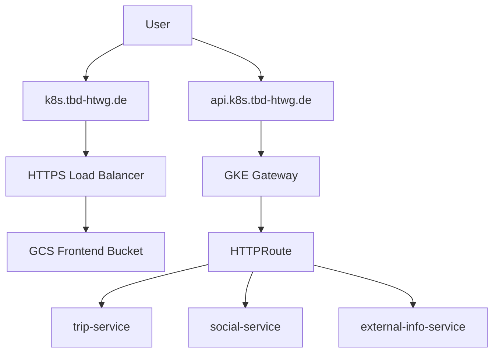
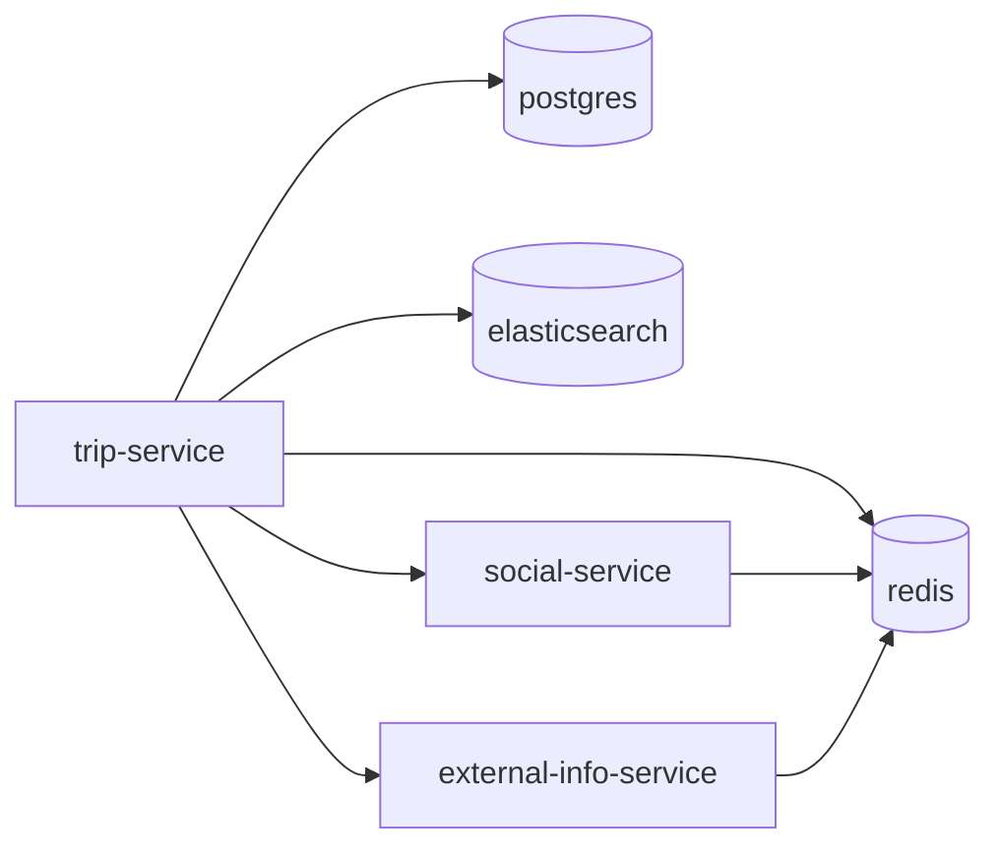

# ms2 Platform Overview

## Status check (step 7)

Step 7 is implemented in code: the Helm chart defines Deployments, Services, HTTPRoutes, ConfigMaps, optional HPAs, and secret references. It follows 12-factor (env-based config, stateless services, logs to stdout). It is usable once secrets are populated and the Gateway TLS setup is completed.

Known gaps to finish before a production rollout:
- Secret values in GCP Secret Manager must be populated (placeholders only).

## What exists right now

### Terraform (cloud resources)
- GCP project bootstrap (APIs, service accounts, IAM bindings, Secret Manager, DNS).
- VPC, subnet, NAT, and GKE Autopilot cluster.
- Storage buckets: frontend assets, images, tfstate.
- HTTPS LB for frontend bucket with managed SSL and DNS A record.

### GitOps (Flux)
- Flux bootstrapped to reconcile [infrastructure/ms2/gitops/clusters/dev](../gitops/clusters/dev).
- Platform add-ons: cert-manager, External Secrets Operator, Gateway, network policies.
- Observability stack exists but is disabled in platform kustomization.

### App deployment
- Helm chart at [infrastructure/ms2/charts/tripplanning](../charts/tripplanning) with:
  - trip-service, social-service, external-info-service
  - HTTPRoute for the API host
  - in-cluster Postgres, Redis, Elasticsearch (low-resource)
- Free/shared tenant wired at [infrastructure/ms2/gitops/tenants/free/shared](../gitops/tenants/free/shared).

## Namespaces in the cluster

- `flux-system`: Flux controllers and Git sources.
- `cert-manager`: certificate manager.
- `external-secrets`: External Secrets Operator.
- `gateway-system`: Gateway resources for API routing.
- `tripplanning-free`: free/shared tenant (services + backing DB/cache/search).
- `default`: currently only baseline NetworkPolicy rules.

## Routing overview

- Frontend:
  - DNS `k8s.tbd-htwg.de` -> GCP HTTPS LB -> GCS bucket `*-frontend-bucket`.
  - The same LB routes `/api/*` to the **api-router** NEG (trip, social, external-info paths).

- API (direct / tooling):
  - DNS `api.k8s.tbd-htwg.de` -> GKE Gateway -> HTTPRoute -> trip/social/external-info services.
  - HTTPRoute lives in the Helm chart and routes paths to services.
  - Browser clients should **not** call this host; use same-origin `/api/v2` on `k8s.tbd-htwg.de` instead.

### Routing diagram



## Application topology in the free/shared namespace



## How to set up a new project (end-to-end)

### 1) Create a new GCP project
- Create the project in GCP.
- Set billing and enable APIs (Terraform handles API enablement during apply).

### 2) Configure Terraform
- Edit [infrastructure/ms2/terraform/envs/dev/terraform.tfvars](../terraform/envs/dev/terraform.tfvars).
- Run:
  - `terraform init`
  - `terraform apply`

Terraform creates:
- network + GKE Autopilot
- buckets
- frontend HTTPS LB + DNS
- base IAM + Secret Manager placeholders

### 3) Bootstrap Flux
- Run Flux bootstrap against this repo (already done once for dev).
- Flux reconciles:
  - platform add-ons
  - tenant configs

### 4) Populate secrets in GCP Secret Manager
Create values for the project-level secrets below. Flux and External Secrets then copy them into each namespace automatically, so you do not need any per-tenant `kubectl create secret ...` steps.

Create values for:
- `tripplanning-db-password`
- `tripplanning-jwt-secret`
- `tripplanning-internal-secret`
- `tripplanning-google-maps-api-key`
- `tripplanning-viator-api-key`
- `tripplanning-ghcr-pull-dockerconfigjson`
- `tripplanning-auth-test-bearer-token` (dev/load-test only — enables Locust/seeder `X-Act-As-User` impersonation; **never on production**)

Purpose of each secret:
- `tripplanning-db-password`: Postgres password for the in-cluster database.
- `tripplanning-jwt-secret`: JWT signing secret for auth tokens.
- `tripplanning-internal-secret`: shared internal token for service-to-service trust.
- `tripplanning-google-maps-api-key`: Places API key used by external-info-service.
- `tripplanning-viator-api-key`: API key for external info service (Viator).
- `tripplanning-ghcr-pull-dockerconfigjson`: Docker auth JSON for the private GHCR image pull secret.
- `tripplanning-auth-test-bearer-token`: Shared test bearer for `TRIPPLANNING_AUTH_TEST_BEARER_TOKEN` on trip-, social-, and external-info services (Locust `PERF_TEST_BEARER` must match).

These are new secrets that you choose per project. Generate strong values on first setup. Terraform also creates the signer service account `tripplanning-image-url-sig@tbd-cloudappdev.iam.gserviceaccount.com`; the trip-service uses it through `GCP_IMPERSONATE_SERVICE_ACCOUNT`.

Example script:

```bash
#!/usr/bin/env bash
set -euo pipefail

PROJECT_ID="tbd-cloudappdev"
GHCR_USERNAME="myname"
GHCR_TOKEN="ghp_mytoken"
GOOGLE_MAPS_API_KEY="ADD_YOUR_GOOGLE_MAPS_API_KEY_HERE"
VIATOR_API_KEY="ADD_YOUR_VIATOR_KEY_HERE"

ghcr_auth="$(printf '%s:%s' "${GHCR_USERNAME}" "${GHCR_TOKEN}" | base64 | tr -d '\n')"
ghcr_config_json="$(printf '{"auths":{"ghcr.io":{"username":"%s","password":"%s","auth":"%s"}}}' "${GHCR_USERNAME}" "${GHCR_TOKEN}" "${ghcr_auth}")"

printf '%s' "$(openssl rand -base64 24 | tr -d '\n')" | gcloud secrets versions add tripplanning-db-password \
  --project "$PROJECT_ID" \
  --data-file=-

printf '%s' "$(openssl rand -base64 48 | tr -d '\n')" | gcloud secrets versions add tripplanning-jwt-secret \
  --project "$PROJECT_ID" \
  --data-file=-

printf '%s' "$(openssl rand -base64 32 | tr -d '\n')" | gcloud secrets versions add tripplanning-internal-secret \
  --project "$PROJECT_ID" \
  --data-file=-

printf '%s' "${GOOGLE_MAPS_API_KEY}" | gcloud secrets versions add tripplanning-google-maps-api-key \
  --project "$PROJECT_ID" \
  --data-file=-

printf '%s' "${VIATOR_API_KEY:-}" | gcloud secrets versions add tripplanning-viator-api-key \
  --project "$PROJECT_ID" \
  --data-file=-

printf '%s' "${ghcr_config_json}" | gcloud secrets versions add tripplanning-ghcr-pull-dockerconfigjson \
  --project "$PROJECT_ID" \
  --data-file -
```

### 4b) Let's Encrypt TLS (now wired)
- cert-manager uses a ClusterIssuer named `letsencrypt-dns` with DNS-01 via Cloud DNS.
- The Gateway TLS secret `api-tls` is issued for `api.k8s.tbd-htwg.de`.
- IAM bindings are configured in Terraform for cert-manager to manage DNS records.
- The `tripplanning-image-url-sig` signer account is managed in Terraform and the workload SA is allowed to impersonate it for signed GCS upload URLs.

### 5) Deploy the application
- Push changes to this repo.
- Flux applies HelmRelease + values config.
- Services and backing stores come up in `tripplanning-free`.

**Step-by-step checklist (HPA, test bearer, Flux reconcile):** [gke-dev-hpa-and-test-bearer-checklist.md](gke-dev-hpa-and-test-bearer-checklist.md)

**After changing GitOps (values, ExternalSecrets, chart):** reconcile Flux manually (requires `flux` CLI and kubectl access to the dev cluster):

```bash
gcloud container clusters get-credentials tripplanning-gke \
  --region europe-west1 --project tbd-cloudappdev

flux reconcile source git flux-system -n flux-system
flux reconcile kustomization tenants -n flux-system
flux reconcile helmrelease tripplanning-free -n tripplanning-free
```

Order matters: Git source → tenant kustomization (ConfigMap, ExternalSecrets) → Helm release (Deployments, HPA).

**Scaling:** edit [gitops/tenants/free/shared/values-configmap.yaml](../gitops/tenants/free/shared/values-configmap.yaml), then push and run the commands above.

- **Fixed replicas** (HPA off): set `services.trip.replicas`, `services.social.replicas`, etc.
- **HPA** (CPU-based): set `autoscaling.enabled: true`, `minReplicas`, `maxReplicas`, `targetCPUUtilizationPercentage`. HPAs exist for trip, social, and external-info in the chart.

Example overlay fragment:

```yaml
autoscaling:
  enabled: true
  minReplicas: 2
  maxReplicas: 5
  targetCPUUtilizationPercentage: 75
services:
  trip:
    resources:
      requests:
        cpu: "500m"
        memory: "768Mi"
```

**Test bearer (Locust / seeder):** set a strong random value in Secret Manager, then let External Secrets sync into `trip-service-secrets` as `TRIPPLANNING_AUTH_TEST_BEARER_TOKEN`:

```bash
PROJECT_ID="tbd-cloudappdev"
printf '%s' "$(openssl rand -base64 32 | tr -d '\n')" | gcloud secrets versions add tripplanning-auth-test-bearer-token \
  --project "$PROJECT_ID" --data-file=-
```

Or add GitHub secret `TRIPPLANNING_AUTH_TEST_BEARER_TOKEN` on backend repo environment **`gke-dev`** and run workflow **Sync GKE Secret Manager secrets**.

Use the same value locally as `PERF_TEST_BEARER` in [performance/.env](../../performance/.env). Requests use `Authorization: Bearer <token>` and `X-Act-As-User: <userId>`.

Force ExternalSecret refresh after updating Secret Manager:

```bash
kubectl annotate externalsecret trip-service-secrets -n tripplanning-free \
  force-sync=$(date +%s) --overwrite
kubectl rollout restart deployment/trip-service -n tripplanning-free
```

### 6) Upload the frontend
- Build frontend with **empty** `VITE_API_BASE_URL` (same-origin `/api/v2`) and upload to the GCS frontend bucket.
- The frontend HTTPS LB on `k8s.tbd-htwg.de` serves the SPA and proxies `/api/*` to api-router.

## Tenant workflow (current)

For now only the free/shared tenant exists.

To add new tenants later:
- Add a new folder under [infrastructure/ms2/gitops/tenants](../gitops/tenants).
- Define namespace, ExternalSecrets, and HelmRelease values.
- Flux reconciles and creates all resources.

## Low-cost notes

- Observability is disabled.
- All services run single replica with small requests/limits.
- Backing services are single-node and low resource.

## Recommended next fixes

- Wire Gateway TLS to a real certificate (managed cert or cert-manager).
- Add Workload Identity IAM bindings for External Secrets.
- Add tenant quotas and NetworkPolicies in tenant namespaces.
